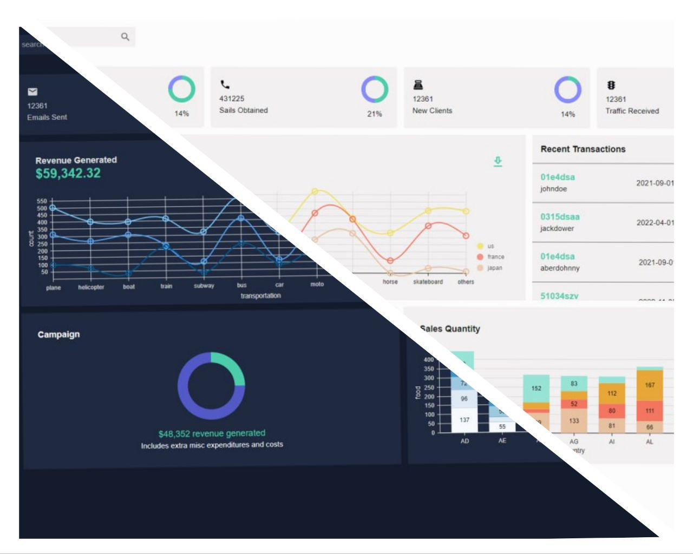
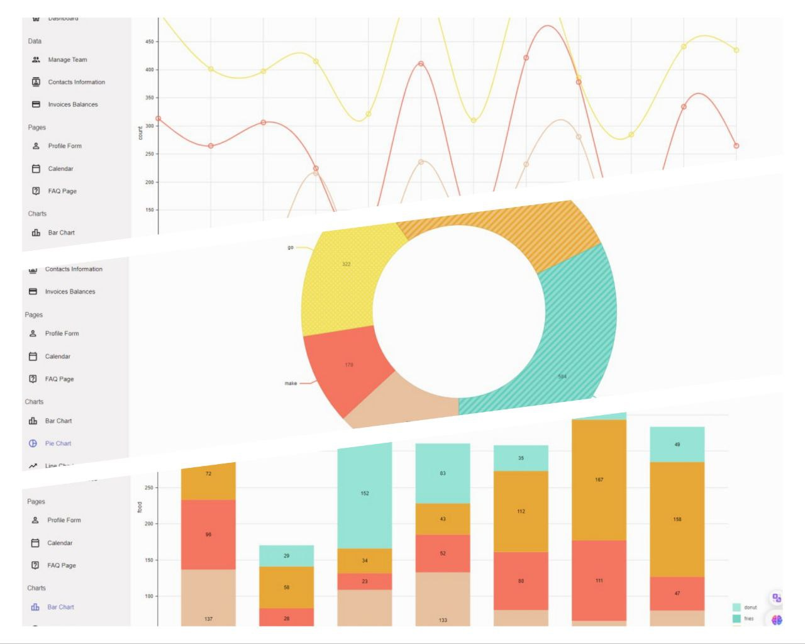
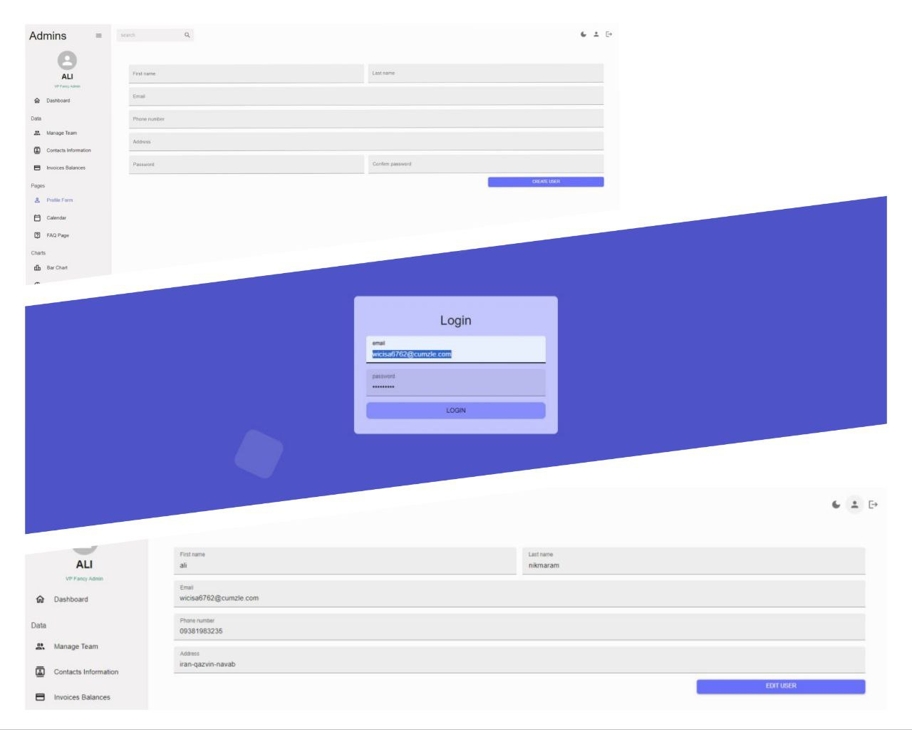
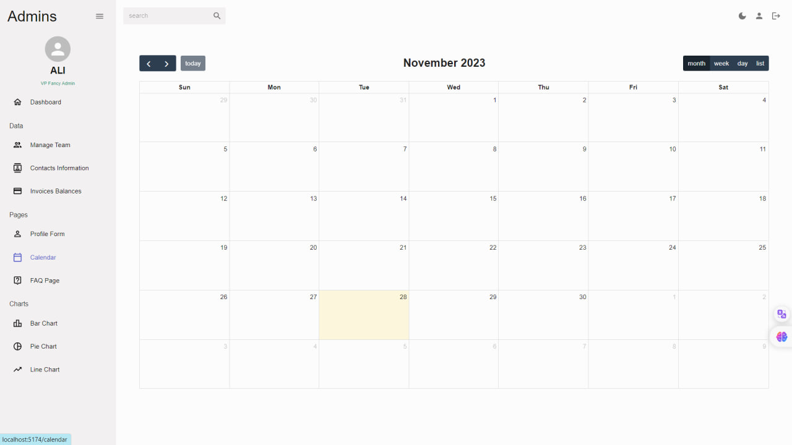

# Admin Dashboard

an admin dashboard for managing user events. This project is built using various
technologies such as Nivo, Formik, Yup validation, MUI, Supabase, Fullcalendar
library, RTK query, and more

# Features

## Charts:

The admin dashboard includes three types of charts - bar, line, and pie. These
charts are created using the Nivo library 

## Forms :

The dashboard includes three forms - login, edit, and create user. These forms
are created using Formik and Yup validation 

## Authentication:

The dashboard includes authentication features using Supabase, ensuring secure
access and user management.

## Calendar:

The dashboard includes the FullCalendar library for managing user events

## Dark Mode

he admin dashboard also has a dark mode feature for better user experience. This
feature allows the user to switch between light and dark modes based on their
preference.

# Technologies Used :

ReactJs, RTK Query, Formik, Yup, MUI, Supabase

take an online look 😉 https://pnadmin-dashboard.netlify.app email :
wicisa6762@cumzle.com password : 2011380Pn
