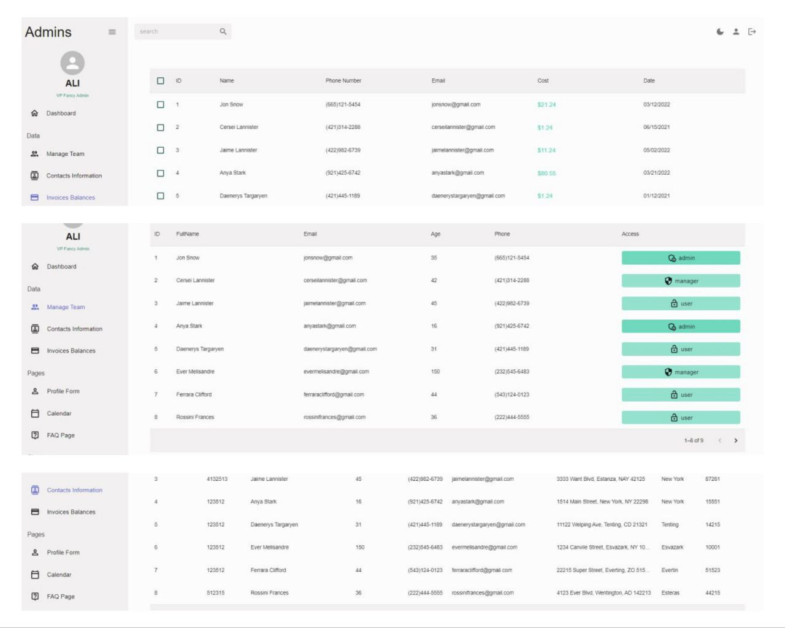

# Admin Dashboard

an admin dashboard for managing user events. This project is built using various
technologies such as Nivo, Formik, Yup validation, MUI, Supabase, Fullcalendar
library, RTK query, and more

# Features

## Charts:

The admin dashboard includes three types of charts - bar, line, and pie. These
charts are created using the Nivo library 

## Forms :

The dashboard includes three forms - login, edit, and create user. These forms
are created using Formik and Yup validation 

## Authentication:

The dashboard includes authentication features using Supabase, ensuring secure
access and user management.

## Calendar:

The dashboard includes the FullCalendar library for managing user events
 

## Dark Mode

### Styling :

The dashboard is styled using Material-UI (MUI)

### Data Fetching :

The project utilizes RTK Query for caching system

# Technologies Used :

## ReactJs, RTK Query, Formik, Yup, MUI, Supabase
